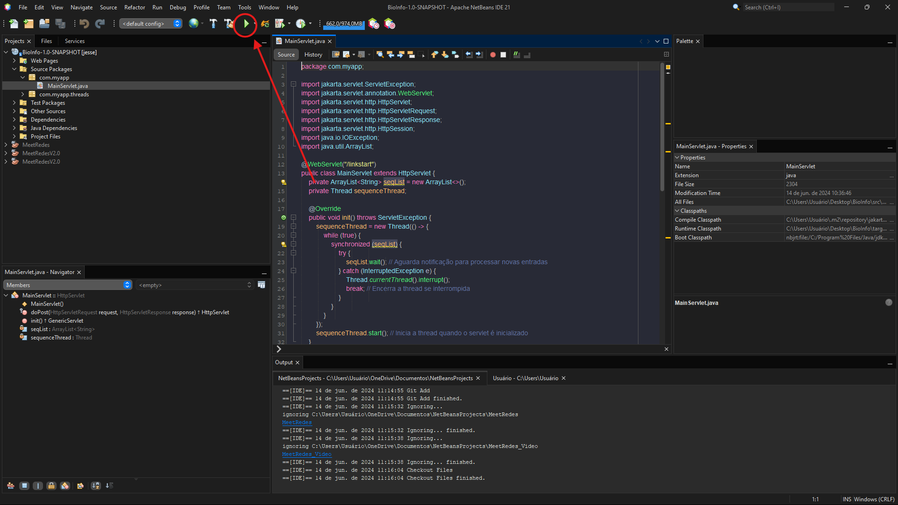

<<<<<<< HEAD
## Projeto Bioinfo

Este é um projeto NetBeans. Se ainda não o tem instalado, acesse: [NetBeans 12.1](https://netbeans.apache.org/download/nb121/index.html).
=======
# bioinform-tica
**Curso:** Bacharelado em Ciência da Computação \
**Professor:** Wosley da Costa Arruda\
**Time**:
* Cássio Coutinho  - [Coutinhopmw](https://github.com/Coutinhopmw)
* Jessé Eliseu     - [jessilver](https://github.com/jessilver)
* Jônatas Souza Madeira - [MelloJ](https://github.com/MellloJ)
* Thiago Soares - [Suarez]()
* João Pedro Ribeiro Dias Moraes - [CaesarCrew](https://github.com/CaesarCrew)

## Sobre o Projeto:
Sistema desenvolvido para a disciplina de Bioinformática e Biologia Computacional, visando comparar a eficiência de diferentes linguagens nas aplicações voltadas para alinhamento de genomas.

*Este é um projeto NetBeans. Se ainda não o tem instalado, acesse: [NetBeans 12.1](https://netbeans.apache.org/download/nb121/index.html).

---
## Versões do sistema:
### v

### Mudanças técnicas
* 
---
>>>>>>> 6854c619f7ca2976d4aca38f2e540e81e169ed2f

### Configuração do Apache Tomcat

Este projeto utiliza o Apache Tomcat como container para rodar os servlets. Se ainda não o tem instalado, confira o tutorial: [Instalação do Apache Tomcat](https://youtu.be/WCQ6idDNiH0?si=v5OO_EIk5d0K3uF9).

### Importação do Projeto

Para importar o projeto no NetBeans:

1. Clique em **File -> Import Project -> From Zip**.
2. Selecione o arquivo `Bioinfo.zip`.

Se o projeto não aparecer diretamente, siga estes passos alternativos:

1. Clique em **File -> Open Project**.
2. Selecione o diretório onde está o projeto `Bioinfo`.
<<<<<<< HEAD

### Executando o Projeto

1. Clique em **play** e espere.

=======
>>>>>>> 6854c619f7ca2976d4aca38f2e540e81e169ed2f
